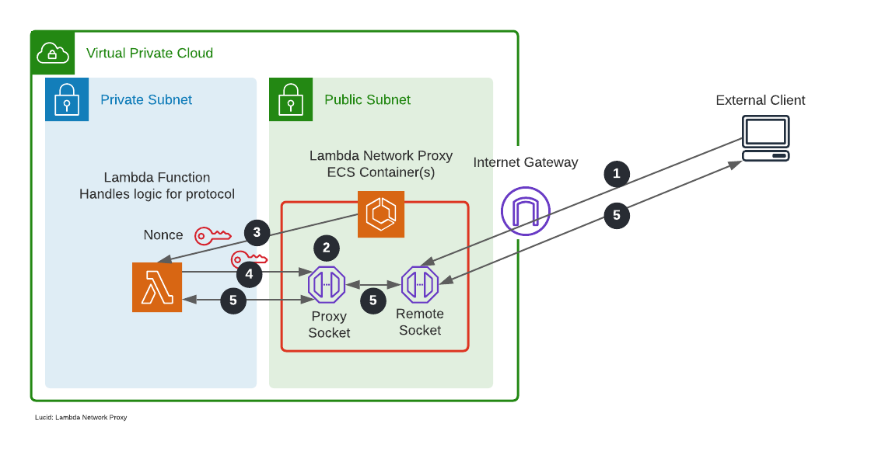

# Lambda Network Proxy

This is a network rendezvous point for Lambda functions that enables them to handle arbitrary TCP and UDP protocols.

This repository contains the code for the proxy. Other repositories of interest:

* [lambda-network-proxy-event-go](https://github.com/dacut/lambda-network-proxy-event-go) — contains the common payload between the proxy and the Lambda function.
* [lambda-echo-server](https://github.com/dacut/lambda-echo-server) — a sample Lambda function implementing the [RFC 862 echo protocol](https://datatracker.ietf.org/doc/html/rfc862) in both TCP and UDP.

## Theory of Operation

### TCP

1. An external client initates a connection to the proxy's remote listening socket.
2. The proxy discovers accepts the connection and creates a proxy TCP socket listening for a connection from Lambda.
3. The proxy invokes the Lambda function, specifying the proxy socket address and nonce.
4. The Lambda function connects to the proxy socket and sends the nonce.
5. The proxy validates the nonce and starts relaying traffic between the remote socket and proxy socket, until either the Lambda function terminates or the connection closes.

### UDP

1. An external client sends a packet to the proxy's remote socket.
2. The proxy discovers that it does not have the external client IP/port in its mapping table and creates a proxy UDP socket for Lambda to send traffic to.
3. The proxy invokes the Lambda function, specify the proxy socket address and nonce.
4. The Lambda function sends a packet containing the nonce to the proxy socket.
5. The proxy validates the nonce and starts relaying traffic between the remote socket and proxy socket until the Lambda function terminates.
